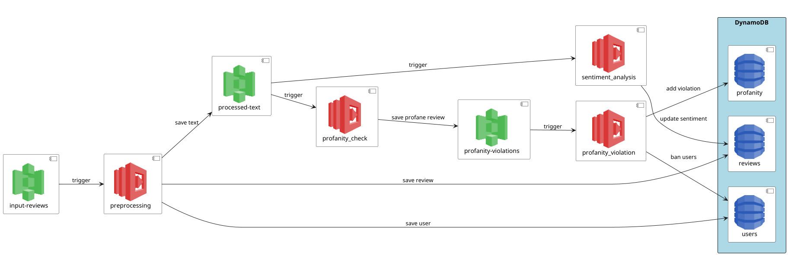

# Instructions for running the task

## Prerequisites

This setup requires Python and ministack to be installed.
The ministack can be started with:

```bash
ministack
```

Do not stop the ministack but open a new terminal to continue to interact with it.

## Running the task

The provisioning and tests are all bundleded in the `run_dev.sh` script.
It creates the S3 buckets, lambda functions, notifications and ultimately starts the tests.

The resources are all provided in this folder. Ensure that you are in the directy for the script to work.

```bash
./run_dev.sh
```

## Architecture

The architecture is designed around S3 bucket events that trigger lambda functions on every new object created.
This way, reviews can be preprocessed, filtered and cleaned data persisted in database tables in a serverless manner.
The diagram below shows the main processing steps.



## Resources

The run script relies on the following resources:
- data: Input data for the tests
- src/lambda: Each folder represents a separate lambda function
- src/test: The integration test script

